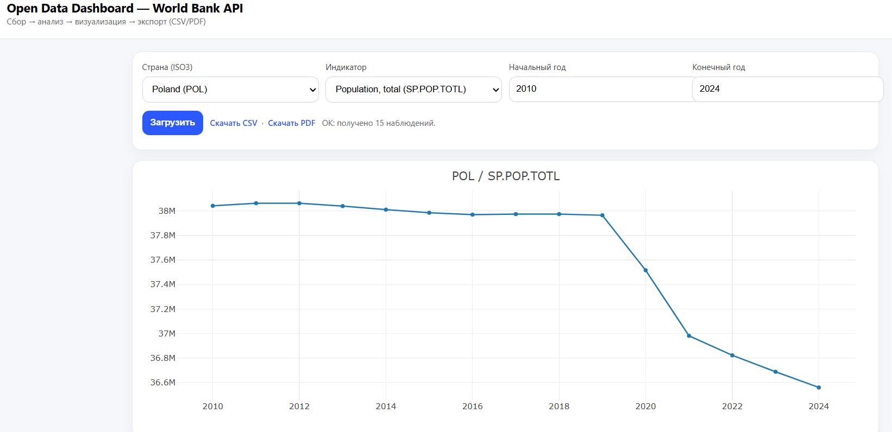

# World Bank Data Dashboard

Прототип веб-ориентированной информационной системы для сбора, анализа и визуализации **открытых данных ТОЛЬКО из World Bank Indicators API (v2)**.



## Возможности

- **Сбор данных**: автоматическая загрузка временных рядов по индикаторам (World Bank API)
- **Обработка и анализ**: очистка, сортировка, расчёт YoY, YoY%, CAGR, базовые выводы
- **Представление**: простой веб-дашборд (HTML + Plotly JS) с интерактивным графиком и таблицей
- **Экспорт отчётов**: CSV и PDF (ReportLab) по выбранным параметрам

## Быстрый старт

### Установка зависимостей
```bash
pip install fastapi uvicorn httpx pandas matplotlib reportlab
```
### Запуск
```
python main.py
```
### Открыть в браузере
[http://127.0.0.1:8000](http://127.0.0.1:8000)

## Технические детали

- **World Bank API**: [https://api.worldbank.org/v2/](https://api.worldbank.org/v2/) (формат JSON через `?format=json`)
- Для простоты список индикаторов/стран в интерфейсе — **"пресеты"**
- В API-эндпойнтах можно передавать любые корректные коды `country` (ISO3) и `indicator`

## Автор
**Roman P.** - [RomanDevelops](https://github.com/roman-245)
